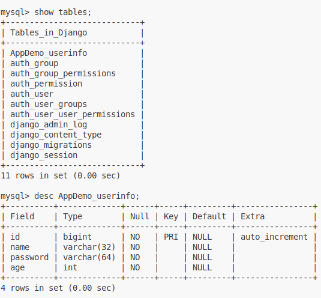

# 1.创建项目
```
django-admin startproject 项目名称
eg. django-admin startproject MyWebServer
```
# 2.项目默认文件介绍
```
MyWebServer
 ├── manage.py
 └── MyWebServer            【项目的管理，启动项目、创建app、数据的管理】(不用修改)
     ├── __init__.py
     ├── settings.py        【项目配置文件】
     ├── urls.py            【URL和函数的对应关系】
     ├── asgi.py            【接收网络请求】(不用修改)
     └── wsgi.py            【接收网络请求】(不用修改)
```

# 3.创建app和说明
- a. 创建命令
```
django-admin startapp app名称
或
python manage.py startapp app名称
```
- b. 项目结构
```
AppDemo
 ├── __init__.py
 ├── admin.py           (不用修改) django默认提供了admin后台管理
 ├── apps.py            (不用修改) app启动类
 ├── migrations         (不用修改) 数据库字段变更记录
 │   └── __init__.py
 ├── models.py          !!!操作数据库
 ├── tests.py           (不用修改) 单元测试
 └── views.py           !!!视图函数
```
- c. 在`settings.py`的`INSTALLED_APPS`字段添加注册app
```py
INSTALLED_APPS = [
    ...,
    'AppDemo.apps.AppdemoConfig',
]
```
# 4. 模板和静态文件
## 4.1 urls -> 函数 对应页面路径
```py
# /AppDemo/views.py
from django.shortcuts import render, HttpResponse

def index(request):
    return HttpResponse("Hello Django!")

# /MyWebServer/urls.py
from django.urls import path
from AppDemo import views

urlpatterns = [
    path('index/', views.index)
]
```
## 4.2 templates模板
```py
# 在/AppDemo/views.py添加并对应配置urls.py
def template_test(request):
    # 配置`settings.py`的`TEMPLATES`的`'DIRS'`列表添加os.path.join(BASE_DIR, 'templates')后，优先去项目目录的根目录去查找文件
    # 去app目录下的templates目录寻找对应的文件(根据app的注册顺序逐个查找)
    return render(request, 'test.html')
```
## 4.3 静态文件(图片、 js、 css)
- 存放在app目录的static目录下
- 也可以配置`settings.py`的`STATIC_URL`指定静态文件的存放位置
### 使用静态文件
- 在html开头添加``
- **使用示例:**``

# 5. 模板语法(类似vue)
- 向`render`函数以字典的形式传入传入数据，格式如下
```py
render(req, 'html文件路径', {'数据名1': 数据1， '数据名2': 数据2， ...})
```
- 循环渲染
```html
<!-- 模板替换 -->
{{ 数据名 }}
<!-- 循环渲染 -->

    ...

<!-- 条件渲染 -->

    ...

    ...

    ...
<!-- 渲染可迭代对象 -->
<!-- 可用 {{ 数据名.索引 }} 或 {{ 数据名.属性名 }} -->
<!-- 或循环渲染 -->
```

# 6.请求和响应
```py
def something(req: HttpResponse):
    """_summary_

    Args:
        req (obj): 封装了用户发送过来的所有请求相关数据
    """
    print(req.method)       # 获取请求方式
    print(req.GET)          # 获取URL上传递的值
    print(req.POST)         # 在请求体中提交数据
    # return render(req, 'something.html')    # 【响应】将模板渲染后返回给用户浏览器
    # return HttpResponse('返回字符串给请求者')  # 【响应】
    return redirect('https://www.baidu.com')  # 【响应】让浏览器重定向到制定网页
```

# 7.数据库操作——ORM框架
1. 创建、修改、删除数据库的表(不能创建数据库、不用写SQL语句)
2. 操作表中的数据
## 7.1安装`mysqlclient`模块
## 7.2创建数据库
```sql
create database Django default charset utf8 collate utf8_general_ci;
```

## 7.3链接数据库
- 修改`settings.py`的`DATABASES`字段
```py
# 官方文档： https://docs.djangoproject.com/en/5.2/ref/settings/#databases
DATABASES = {
    'default': {
        'ENGINE': 'django.db.backends.mysql',       # 配置数据库引擎
        'NAME': 'Django',                           # 数据库名称
        'USER': 'chasedream',                       # 数据库管理员名称
        'PASSWORD': '608630dkf',                    # 数据库管理员密码
        'HOST': '127.0.0.1',                        # MySQL安装的机器
        'PORT': 3306,                               # MySQL端口
    }
}
```
## 7.4操作表——`models.py`
- step1: 在`models.py`中建表
```py
class UserInfo(models.Model):
    """等价于
    create table AppDemo_userinfo(
        id bigint auto_increment primary key,
        name varchar(32),
        password varchar(64),
        age int
    );
    """
    name = models.CharField(max_length=32)
    password = models.CharField(max_length=64)
    age = models.IntegerField()

```
- step2: 执行命令, 会遍历在`settings.py`注册的所有app的`models.py`建表
```sh
python manage.py makemigrations
python manage.py migrate
```

- step3: 删除表或某个属性列将其注释\删除并执行指令即可
- step4: 谨慎修改\添加属性列，可按命令行提示修改或添加默认值或允许其可以为空
 eg1.按命令行提示按命令行提示添加默认值
```py
class UserInfo(models.Model):
    ...
    test1 = models.IntegerField() # 按命令行提示添加默认值
```


 eg2.直接设置默认值
```py
class UserInfo(models.Model):
    ...
    test2 = models.IntegerField(default=2) # 直接设置默认值
```

 eg3.允许其可以为空
```py
class UserInfo(models.Model):
    ...
    test3 = models.IntegerField(null=True, blank=True) # 允许其可以为空
```


# 7.5增删改查
1.新建数据
```python
# 新增数据 <=> inert into AppDemo_department (title) values('销售部')
models.Department.objects.create(title = "销售部")
models.Department.objects.create(title="IT部")
models.Department.objects.create(title="运营部")
models.UserInfo.objects.create(name="Tom", password='123456', age=19)
```


2.删除数据
```py
models.Department.objects.filter(id=4).delete() # 条件删除
models.Department.objects.all().delete()          # 全部删除
```


3.获取数据
```py
data_list = models.UserInfo.objects.all()   # 获取所有数据,为QuerySet类型
print(data_list)                            # <QuerySet [<UserInfo: UserInfo object (1)>, <UserInfo: UserInfo object (2)>]>
for item in data_list:
    print(item.name, item.password, item.age)
    """
    Tom 123456 19
    Jim 123456 19
    """

data_list = models.UserInfo.objects.filter(id=1)    # 条件查询,然后循环遍历
# OR
row_obj = models.UserInfo.objects.filter(id=1).first()
```
4.数据更新
```py
models.UserInfo.objects.all().update(password=999)            # 更新所有数据
models.UserInfo.objects.filter(id=2).update(password=123456)   # 条件更新数据
```

# 8. Django组件
- Form
- ModelForm